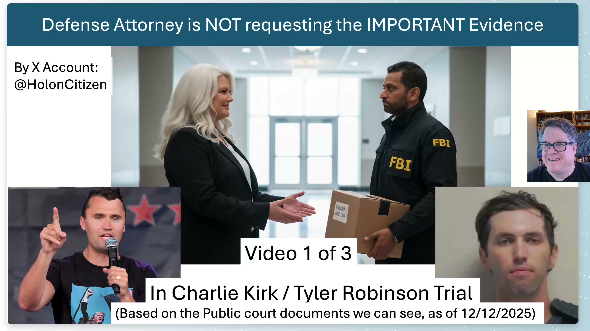

[Top of Charlie Kirk Investigation](../README.md)

# Discovery Request Problems (#1 of 2)

[YOUTUBE VIDEO HERE](https://www.youtube.com/watch?v=yOQ_lG--3bk&t=1s)

[X Discussion & Video & Post HERE](https://x.com/HolonCitizen/status/2026327997251551232)

I think I have found a really big worry in the Charlie Kirk court case that just started. Right now, the court case just started and the initial legal paperwork has gone through the court. I've analyzed that and I want to show something that I think is going to be a very big problem.  This is Part #1 of a #2 part series.

This is the case where the defense attorneys went off and submitted what they requested for evidence to be handed over. This is where I think the root problem is — there's going to be a big problem. My concern is that if the discovery request is too narrow, it could result in Tyler Robinson going to prison without ever uncovering whether an intelligence service was behind the assassination. So I'll go over specifics.

Critical to See:
* I worry I will be disposed of (into the grave or legally framed). Below link says why:
* https://github.com/BryanStarbuck/Bryan_Starbuck_Lawfare
* My name is Bryan Starbuck
* I (Bryan Starbuck) am calling on Thomas Massie to create a CHARLIE KIRK FILES DISCLOSURE, which I wrote up here:
* https://github.com/BryanStarbuck/Charlie_Kirk_175_Critical_To_Expose
* https://github.com/BryanStarbuck/Charlie_Kirk_Dangerous_Investigation
* I am having to release a LONG list of my investigation today on my X and YouTube account, that hasn't be released before.
* My Full CK Investigation: https://youtube.com/@HolonCitizen

I've been going over the legal documents and specifically over the request for discovery. And this is where I think we have a very clear documented problem. And unless I'm interpreting this incorrectly, anyone can try to let me know if they see otherwise.

But this is what they are requesting. When you want a laundry list, you know, in citizen-readable terms of what the legal documents are saying, you will see this over here — this is a list that they are requesting to be received. My worry is this is a very narrow scope that may not be sufficient to uncover whether a nation state or an intelligence service was behind the assassination. So let me go over specifics.

The part that I do like seeing that they requested is the security camera footage they are requesting. So that security camera footage is important. I did not see a request for the video footage from the TPUSA cameras. Those are critical because they were about 8 feet away from Charlie Kirk as he died. And it had all of high resolution 4K, high frame rate video footage — it will be really critical. So I did not see that, and that's an important missing part.

Now I'll do a number of series of videos to cover this. And this one, I want to go over four things that I think are important for discovery because they will uncover an intelligence service behind this.

Now here is the key thing that the defense — this is the key to go get their client to walk absolutely free, and I'll go through that more at the end. But these are four things that I think are critically important and that I was surprised to not see included in the discovery request.

So number one is that it appears that a private contracting company that does surveillance — with the Mark Inc. Corporation with the Piper, the specific plane right here — was contracted to do surveillance. And its exact window of the assassination: immediately up before it, about 45 minutes, to finish up their surveillance 45 minutes before the assassination and only 15 minutes until the shooter enters the campus. So it appears the discovery request is missing something critical to go get all the information behind any serious actor that hired this surveillance company, and then also consume the surveillance data out of it while they were carrying out this operation. So this was definitely not hired by some 22-year-old college dropout. This is definitely more serious, and then finding out who contracted this is really important.

And then the second here is that this drone footage — there's been reports of military drones, there's reports of civilian drones — getting this information is really critical. I did not see this in the request for discovery. By seeing the presence of military drones and their operators, we will be critical to help uncover this.

In previous reporting, whether it's Candace Owens or others, you'll hear a term "Egyptian military contractors," and they may not be military, it may not be Egyptian, but kind of the phrase being used. Now they were at the airport, they flew in on these government, foreign government intelligence service type planes, and the military contractor crews that were at least having intelligence-level security to get past security of the airport using intelligence-level badges. They were running military drone exercises at the airport on a section of the airport a number of days up to the assassination. And there was other reports by a groundskeeper at the UVU that may well have said that they saw them with drones at UVU at the day of the assassination. That part we need to go double-check and confirm, but I got an initial report on that.

Now over here is the airport. So they had Charlie Kirk, which Candace Owens says is very strange, flying into a farther away airport when it would make sense for him to fly into this airport. But this airport is the one where they had these "Egyptian," quote unquote, airplanes that were here, in part that Charlie would have identified because they've been following him around up to 73 times — him, his wife, and their events. So this is the airport where the military planes were at.

The report was that these military "Egyptian military contractors" or non-US were doing a specific kind of thing called counter-UAS. That's specifically drones — unmanned aerial systems — which are effectively military-level drones with their advanced electronics for military operations with drones. And they were doing that a number of days at the airport when they came in on that plane, and this was right here, and these drills were done right up to the assassination. So the question is, why wasn't this included in the discovery request? I don't understand the reasoning behind leaving this out.

Here we're going off to the next big point. So the reporting had been that there were a big group of cars and visitors at Tyler's apartment the day or night before the assassination. Now when I looked at the number of things requested, it was very simple stuff to get him in prison and along the lines of a narrative of a lone wolf. So I did not see them requesting about the multiple people at his apartment and their connections to intelligence service, cell phones, and all that. This was all missing, and this was really, really critical because this would tie over to an intelligence service.

So the main point here is this is coming from the defense side. I would have expected a much broader discovery request to help their client's case.

My previous account had been completely censored on X. So I have a new account. It's Haulin Citizen. You'll see me go after these issues — follow me if you want to learn more.

The question is, this is the time for them to submit discovery. They've submitted a list for discovery. We've got those documents. Unless we're missing something, all of this is missing. So let's come back over to that list, these four items right here.

Now this right here cracks it open to an intelligence service carrying out the assassination and being able to prove it, both in the first trial with Tyler Robinson, but also it allows citizens to go get access to that data through court discovery for continuing the investigation. And then if they're able to railroad Tyler Robinson in the first court case, getting this information into the court case — the first case is critical because it will be used for appeals if there's injustice done during the first court case. If they fail to get this critical information into the first court case, they will be locked out of it in appeals, and it'll lock him into a lone wolf and hide the intelligence service behind that.

Now I'll get off to the next point which I'll be doing, which is there's a legal strategy — a big mistake being done by the prosecutors because they want to railroad this into a lone wolf. They are charging him with murder. Now when you look at the list of charges, you'll find out that their mistake is they're not charging him with attempted murder.

So what happens here is they are doing effectively a lone wolf trial, but they risk it all. If we, as his investigators, pry out that this is done by an intelligence service, then what will happen is — if we show that the cause of death is done by a different assassin of an intelligence service, whether it was a no-fingerprint exploding lapel pin or it was through the ear, which the other photo has of blood coming in from another shot through the ear — if that gets documented and proves that he's not the cause of death, because they are so much into a lone wolf charge, they do not put on the attempted murder.

So what happens is, if through the trial defense attorneys being smart, they go prove an intelligence service committed it and the cause of death was not by Tyler Robinson or his rooftop location — it was done by another point — then what happens is they could have put Tyler Robinson in prison for attempted murder, being in the location with a gun, even though if he never even fired or it was a blank or he never hit it. At least they put him in prison for attempted murder. But because they're going all in on lone wolf and they do not put the attempted murder on there also, they either want to slam him into prison for a lone wolf or lose it all and he walks free. So that's very, very important.

Now the defense attorneys and their team must go equally hard to go get all these intelligence service connections into the case. But when you look at that list, the items that could connect this to an intelligence service are all missing. The discovery request as it stands seems focused on a lone wolf narrative, and I find that very surprising given the stakes of this case. I hope there's a strategic reason I'm not seeing, but from the outside looking in, these omissions raise serious questions, in my personal opinion.

Again, my last account was completely censored, and so here — Haulin Citizen is my new account. I'll have a lot more coming out.

What I'm doing is having my programming background — have a lot of programming scripts running LLM, ChatGPT, and a lot of LLM AI over legal documents, effectively almost giving me a team of 100 attorneys analyzing every document from every angle and pulling out insights and being able to release it incredibly quickly. I can't afford 100 attorneys to be working for a thousand hours each, but with AI, I can effectively do that and have incredible turnaround. So I plan to release more information on my X account here, and you can come and follow me there for more.

And then I'll show one more thing. My day job is on an AI company — I'm the founder CEO and I'm building AI to do filmmaking. It's http://Act3AI.com, and I'll be using this in the Charlie Kirk investigation. So it's a very fast way to just type in "he said this, she said that," it pops into a script and immediately films, and it goes through whether it's a real movie or the cartoon mode I have it in right now.

And so you'll see a lot of this analysis I do in the Charlie Kirk investigation, and you'll see that we'll create content here to go through important parts of the investigation. And my background here of my day job to create the filmmaking here will be useful for the Charlie Kirk thing, but my programming background here with the AI will be important to write the scripts to basically act as a hundred attorneys analyzing the court case as soon as documents come out and process those to find out where there are missing parts of it. So you will see that in my coverage, and you'll see that on the Twitter page.

## Slides

