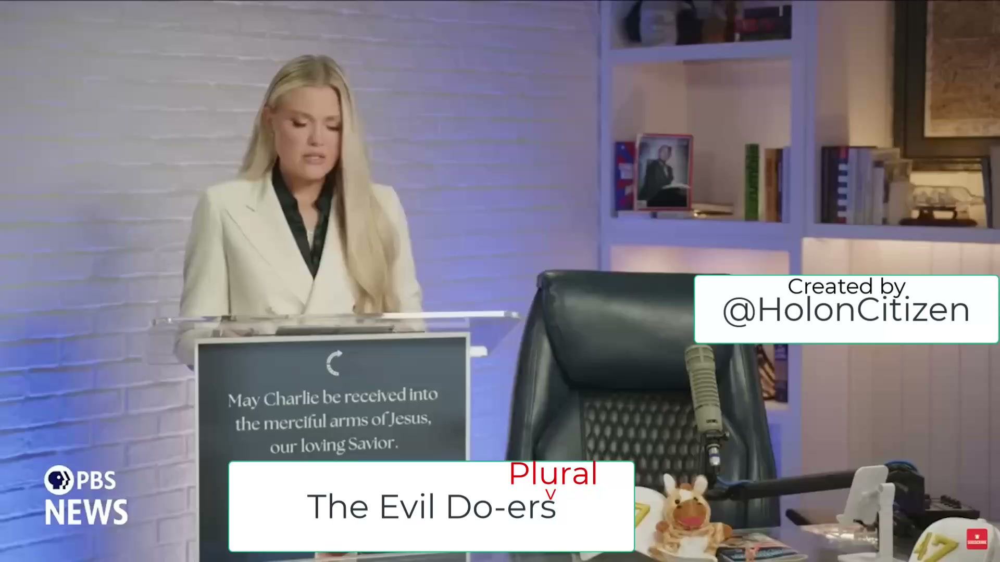

[Top of Charlie Kirk Investigation](../README.md)

# Erika Says "Evil Do-ERs"

[YOUTUBE VIDEO HERE](https://www.youtube.com/watch?v=j8krfDUkhE4) <== Important

[X Discussion & Video & Post HERE](https://x.com/HolonCitizen/status/2026283251745403046) <== Important

BIG SECRET: She says the Quiet Part out Loud... "evil Do-ERs" (Plural).  She only said it once but I think it was intentional.  

Her speech below happened in 55 hours after. (Speech 9/12/2025 @ 9:09pm ET).
Important:
* You will note that the announcement "Erika will be the new CEO of TPUSA" happened 8 days after Charlie.  (9/18/2025 @ 10:55am MT).
* I think there was big risk of her not getting that CEO position.  I think the board "may" have been loyal to something other than Charlie or Erika.
* I think foreign interests decided to allow her to be CEO of TPUSA, but she had to stop the "evil Do-ERs" (Plural).
Very strange she would be "announced" CEO 8 days later.  Could "negotiations" need to happen before foreign interests decided she was "safe"?  If not, why take 8 days?

## Slides

