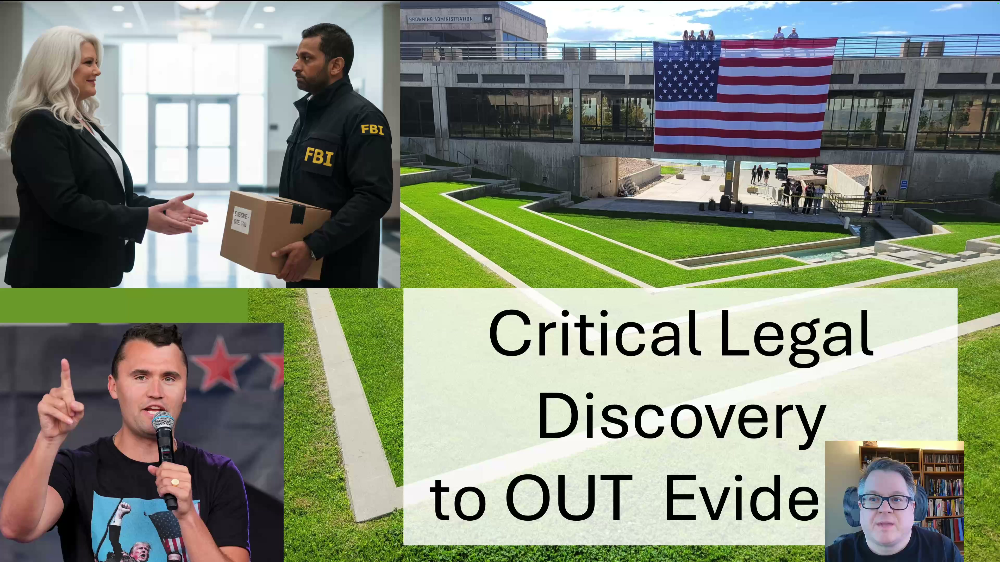

[Top of Charlie Kirk Investigation](../README.md)

# Full Discovery Analysis

[YOUTUBE VIDEO HERE](https://www.youtube.com/watch?v=5M0tH82oyzc)

[X Discussion & Video & Post HERE](https://x.com/HolonCitizen/status/2026335302391136557)

BIG SECRET: She says the Quiet Part out Loud... "evil Do-ERs" (Plural).  She only said it once but I think it was intentional.  He speech below happened in 55 hours after. (Speech 9/12/2025 @ 9:09pm ET).
Important:
* You will note that the announcement "Erika will be the new CEO of TPUSA" happened 8 days after Charlie.  (9/18/2025 @ 10:55am MT).
* I think there was big risk of her not getting that CEO position.  I think the board "may" have been loyal to something other than Charlie or Erika.
* I think foreign interests decided to allow her to be CEO of TPUSA, but she had to stop the "evil Do-ERs" (Plural).
Very strange she would be "announced" CEO 8 days later.  Could "negotiations" need to happen before foreign interests decided she was "safe"?  If not, why take 8 days?

Critical to See:
* I worry I will be disposed of (into the grave or legally framed). Below link says why:
* https://github.com/BryanStarbuck/Bryan_Starbuck_Lawfare
* My name is Bryan Starbuck
* I (Bryan Starbuck) am calling on Thomas Massie to create a CHARLIE KIRK FILES DISCLOSURE, which I wrote up here:
* https://github.com/BryanStarbuck/Charlie_Kirk_175_Critical_To_Expose
* I am having to release a LONG list of my investigation today on my X and YouTube account, that hasn't be released before.
* My Full CK Investigation: https://youtube.com/@HolonCitizen

NEW: Charlie Kirk & Trial for Tyler Robinson: I have never released this. I have something I consider quite big and really critical to this Charlie case with Tyler on trial on the September event. This is something I've worked on for three months and it's pretty important. Let's dig into it.

There's discovery. Legal discovery where the defense team can go pull out documents from the government and get them into the trial. So I built up a list of 175 things that should have been in discovery in my opinion, and that can be added. And then what these do is these are things that for me doing deep investigation, non-stop since it happened, and others pouring through everything else everybody else has done, that this is my massive list to what we could go pull from the government. And when they hand over all these files in this case, that this is not happening now, then it could give us proof to go prove this.

Now there's two tracks of what's going on. There is a local state level trial, and so this is the structural problem. And between both defense and the prosecution side, they set things down this way that the local law enforcement has almost considered their box, their office, whatever, of the storage of evidence that they have at this localized state level. It is what it is.

Now during the trial, they have to hand that over to defense. Now the FBI and more at the federal level could have investigated a ton, have a lot of files, but so far that's just not going to come over.

## Slides

