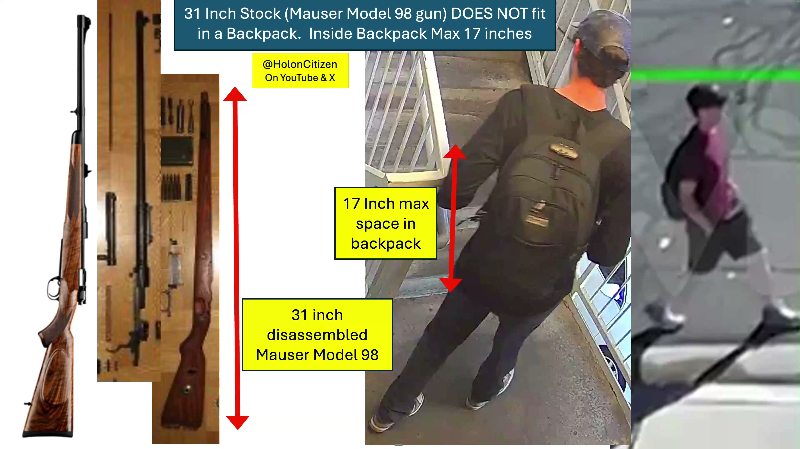

[Top of Charlie Kirk Investigation](../README.md)

# Gun Couldn't Fit - Why It Isn't Tyler

GUN Tyler couldn't get INTO UVU. Why it isn't him.

[YOUTUBE VIDEO HERE](https://www.youtube.com/watch?v=R0XqudbX3xk)

[X Discussion & Video & Post HERE](https://x.com/HolonCitizen/status/2026284447038103916)

Tyler Robinson (CharlieK / UVU): Tyler couldn't get the gun away, to leave it in the woods. Proof here. Even broken down, it won't fit in his pants or backpack. This has more proof Tyler wasn't the shooter. And Tyler (alone) couldn't have gotten the gun away.

Tyler Robinson got gun to UVU.  This PROVES, either: 1) More people were involved and got any gun onto UVU,  or  2) Tyler placed the gun there a previous day.

* I think we can rule out #2 by UVU security camera footage. When we will force that to be released by the US gov. Note that is one of the few things in Tyler's Defense legal team's list for [Discovery](../Discovery_1/README.md). So we will get that out after trial from trial public docs.
* Below is right after he got out of his car 8:07am and started to walk to UVU. Impossible to hide gun with shorts.
* It is natural to try to prove/dis-prove if he left with the gun.  The easier way to prove others were involved, is that they had to bring the gun there. Tyler in shorts makes it 100% impossible he is getting the gun onto UVU that day.  Later UVU security camera will prove he didn't do it days prior.

Critical to See:
* My Full CK Investigation: [https://youtube.com/@HolonCitizen](https://youtube.com/@HolonCitizen)
* [Bryan Starbuck Lawfare](https://github.com/BryanStarbuck/Bryan_Starbuck_Lawfare)
* My name is Bryan Starbuck

## See Also

* [Discovery Request Problems](../Discovery_1/README.md) — what's missing from the discovery request
* [Full Discovery Analysis](../FULL_Discovery_1/README.md) — the 175 items for discovery
* [Drone Plane N1098L at UVU](../N1098L/README.md) — more evidence of others involved

## Slides

