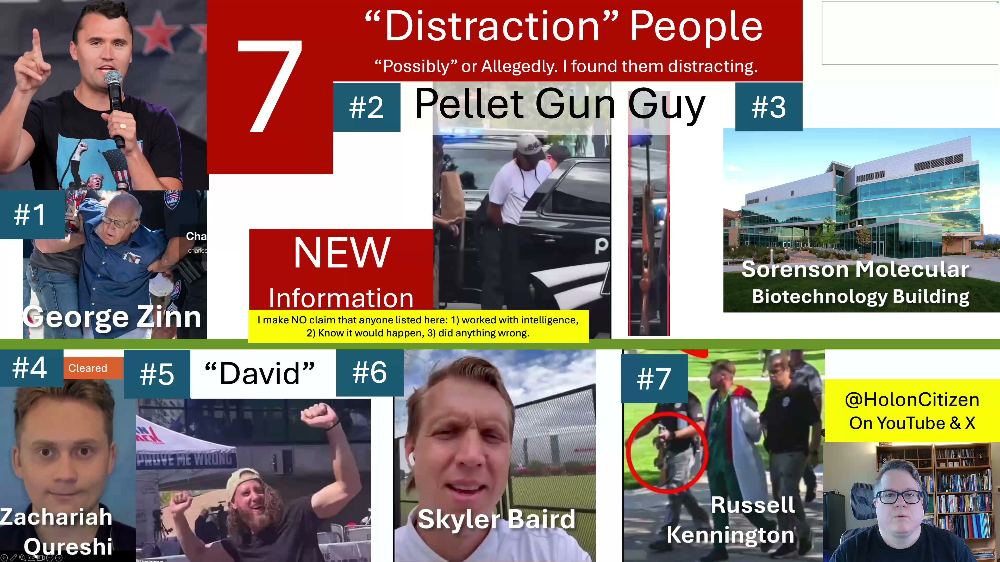

[Top of Charlie Kirk Investigation](../README.md)

# Pellet Gun Silencer Decoy

The Pellet Gun Guy — Silencer on an Air Gun Near Charlie Kirk Event | Distraction People #2

[YOUTUBE VIDEO HERE](https://www.youtube.com/watch?v=0ypTlz84mc8) <== Important

[X Discussion & Video & Post HERE](https://x.com/HolonCitizen/status/2026320176283849005) <== Important

In this video, we examine Distraction Person #2 from the Charlie Kirk investigation — the Pellet Gun Guy. This one has some uniquely interesting details that nobody else has covered.
Critical to See:

* My name is Bryan Starbuck
* I (Bryan Starbuck) am calling on Thomas Massie to create a CHARLIE KIRK FILES DISCLOSURE, which I wrote up here:
* https://github.com/BryanStarbuck/Charlie_Kirk_175_Critical_To_Expose
* https://github.com/BryanStarbuck/Bryan_Starbuck_Lawfare
* https://github.com/BryanStarbuck/Charlie_Kirk_Dangerous_Investigation
* I am having to release a LONG list of my investigation today on my X and YouTube account, that hasn't be released before.
* My Full CK Investigation: https://youtube.com/@HolonCitizen

This individual was arrested about 11 minutes north of UVU, where the Charlie Kirk event took place. He was carrying an airsoft or pellet gun — not a rifle. But here is the detail that jumps out: someone put a silencer on it. You do not need a silencer on an air gun. They are already quiet. There is no explosion, no gunpowder. The silencer serves no functional purpose — except to look scary and grab maximum attention. That is exactly what a "white rabbit" decoy is designed to do.

I was able to hunt down the exact location of the arrest in Provo — in front of Joe Vera's restaurant — by matching second-floor windows, camera angles, and nearby landmarks. Nobody had posted this location anywhere online. Having the precise address enables targeted FOIA requests to trace the chain of events.

KEY QUESTIONS:

- What is his name?
- Who provided the pellet gun with the silencer?
- Who reported him to police?
- Was anyone communicating with him before the event?
- Why are the arrest records scrubbed or inaccessible?
IMPORTANT: This is not saying this person did anything illegal or immoral. He may have been an unwitting pawn — researched, positioned, and then used as bait to tie up police resources at a critical moment. The real investigation trail leads UP the chain of command: who set it up, who authorized it, and why.

NEXT STEPS FOR INVESTIGATORS:

- File FOIA requests for arrest records and incident reports
- Identify the individual through police records
- Trace the origin of the weapon and the silencer
- Determine who made the report to police
- Examine whether anyone recruited or directed him
- If requests are blocked, that itself is significant
TIMESTAMPS:

0:00 — Introduction: The Charlie Kirk investigation and seven distraction people
— White rabbits: What they are and why intelligence services use them
— Historic examples of decoy rabbits
— Distraction Person #2: The Pellet Gun Guy
— The silencer on an air gun — why it makes no sense functionally
— Hunting down the exact arrest location in Provo
— Joe Vera's restaurant and the precise address
— Scrubbed records pattern across distraction people
— Key questions and investigative to-do list
— The unwitting victim pattern: how people get used without knowing
— Following the management chain upward
— Censorship and why reposts matter
— Upcoming tools: AI Attorney, anti-censorship, documentary film
— Other videos in the series
COMING SOON:

- AI Attorney — open source, free legal research tool
- Anti-censorship tools for citizen investigators
- A documentary film on the full investigation
If you find this valuable, please LIKE, SUBSCRIBE, and especially REPOST/SHARE. I am heavily censored on these topics and your shares are the only way this information reaches people.

## Slides

